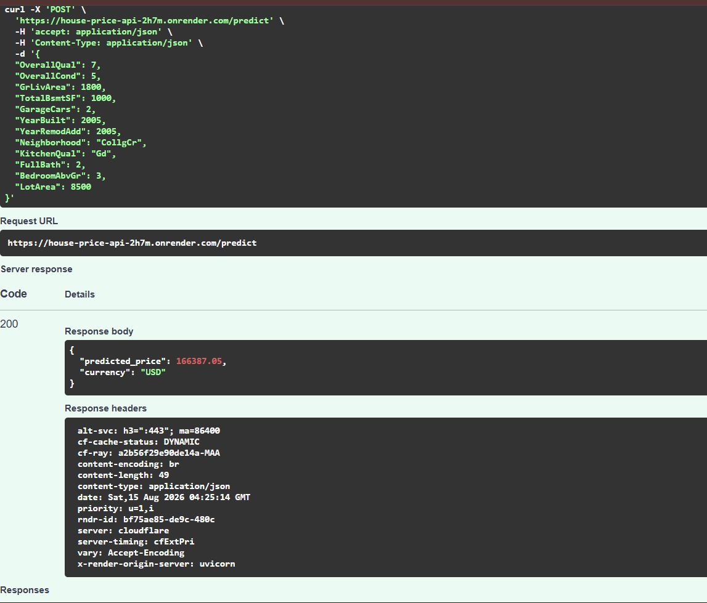
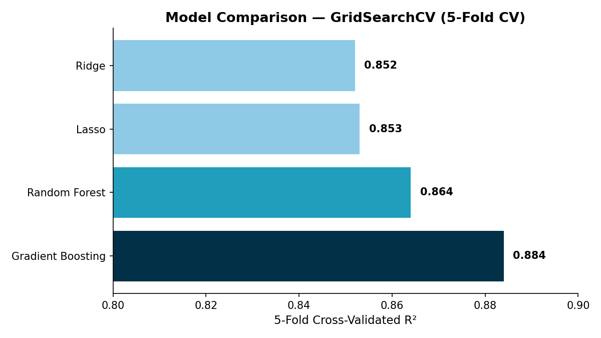

# House Price Prediction — Ames Housing Dataset

Predicting residential home sale prices using the Kaggle "House Prices - Advanced Regression Techniques" competition dataset (the Ames Housing dataset). Built as a hands-on project to practice real-world data cleaning and classical ML model comparison — no deep learning involved.

## Dataset

- Source: [Kaggle — House Prices: Advanced Regression Techniques](https://www.kaggle.com/competitions/house-prices-advanced-regression-techniques)
- ~1,460 training rows, 79 raw features describing residential homes in Ames, Iowa
- Target: `SalePrice`

## Approach

### 1. Data Cleaning
- Distinguished "missing because the feature doesn't exist" (e.g. no pool, no garage) from genuinely missing data
- Filled "doesn't exist" columns with `"None"` / `0`; filled genuinely missing values with median (numeric) or mode (categorical)
- Reviewed outliers (e.g. unusually large lots) by cross-checking related columns rather than blindly removing them — kept legitimate extreme values

### 2. Encoding
- **Ordinal columns** (e.g. `ExterQual`, `KitchenQual`) mapped to numbers preserving their natural rank (Poor → Excellent)
- **Nominal columns** (e.g. `Neighborhood`, `RoofStyle`) one-hot encoded
- Train and test sets were encoded **together** before splitting back apart, to avoid category-mismatch bugs from `pd.get_dummies` with `drop_first=True`

### 3. Feature Scaling
- `StandardScaler` fit on training data only, applied to both train and test (no data leakage)

### 4. Modeling
- Target (`SalePrice`) was log-transformed (`log1p`) to correct right-skew, which meaningfully improved linear model performance
- Compared four algorithms fairly using **5-fold cross-validation** + `GridSearchCV` for hyperparameter tuning:

| Model | Best Params | CV R² |
|---|---|---|
| Ridge Regression | alpha=100 | 0.852 |
| Lasso Regression | alpha=0.01 | 0.853 |
| Random Forest | max_depth=20, min_samples_leaf=2, n_estimators=100 | 0.864 |
| **Gradient Boosting** | learning_rate=0.1, max_depth=3, n_estimators=200 | **0.884** |

Gradient Boosting performed best under fair, cross-validated comparison.

## Key Learnings
- A single train/test split can overstate performance — cross-validation gives a more honest estimate
- Log-transforming a skewed target is often the single biggest lever for linear models
- Regularized linear models (Ridge/Lasso) can already absorb a lot of multicollinearity — manual feature pruning didn't add much on top
- Encoding train and test data separately can silently corrupt features when rare categories don't appear in both sets — always encode jointly, then split

## Tech Stack
Python, pandas, scikit-learn, matplotlib

## Files
- `house_price_prediction.ipynb` — full notebook (cleaning → encoding → scaling → modeling → evaluation)
- `submission.csv` — final Kaggle submission generated from the best model
- `main.py`, `preprocessing.py`, `train_and_save.py` — FastAPI serving layer (deployed live above)

## Live Demo

Try the API here: [https://house-price-api-2h7m.onrender.com/docs](https://house-price-api-2h7m.onrender.com/docs)

> Note: hosted on Render's free tier, so the first request after inactivity may take up to ~50 seconds to wake up.
